# python_labs

## Лабораторная 1

### Задание 1

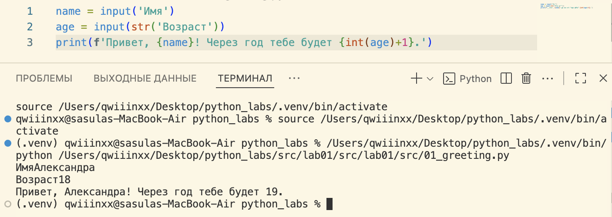


### Задание 2

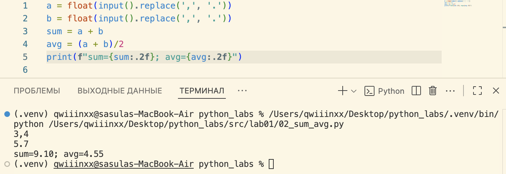


### Задание 3

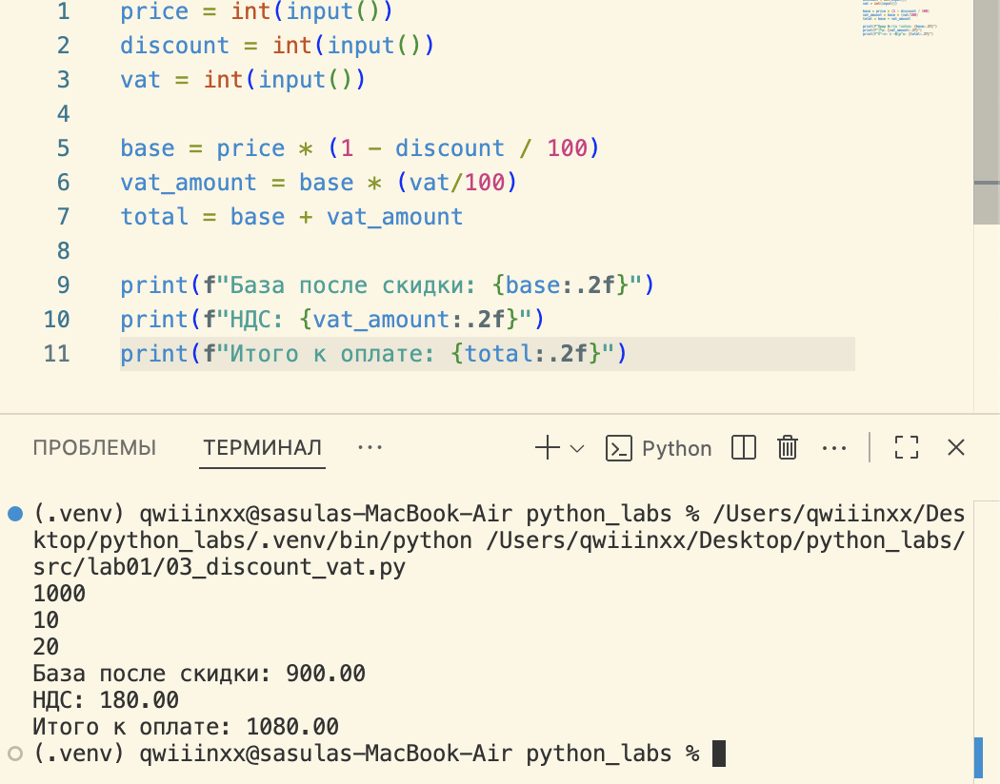


### Задание 4

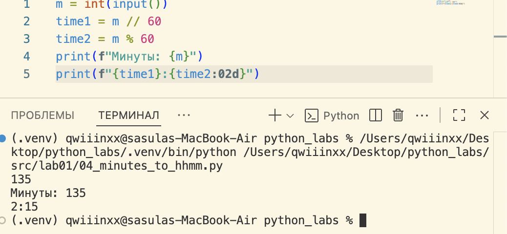


### Задание 5

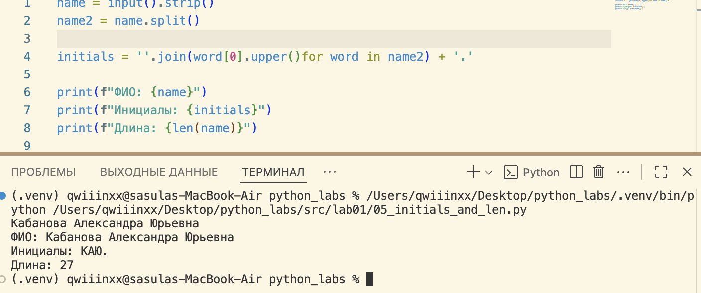


### Задание 6

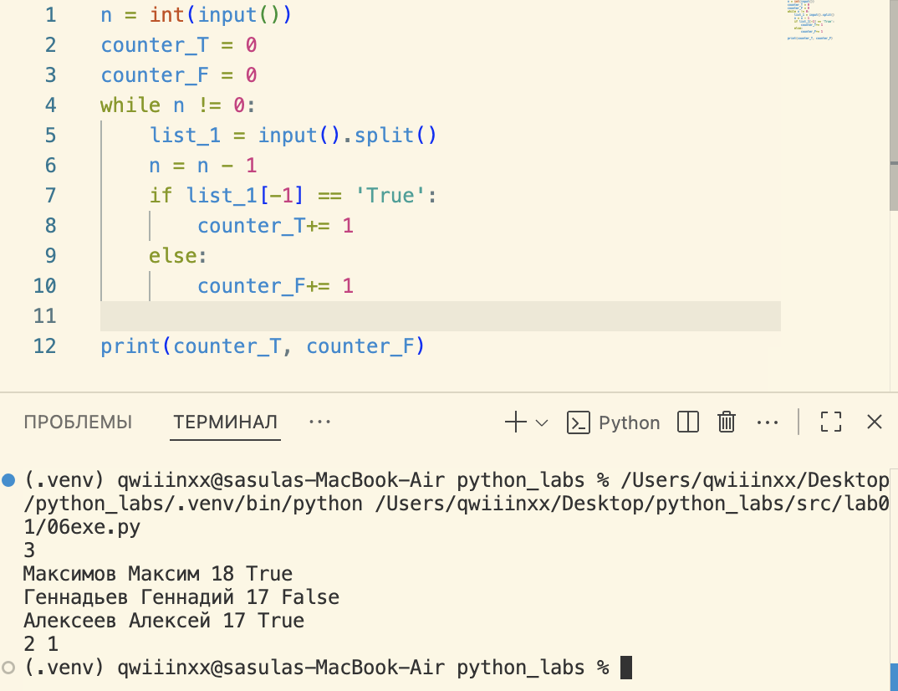

### Задание 7

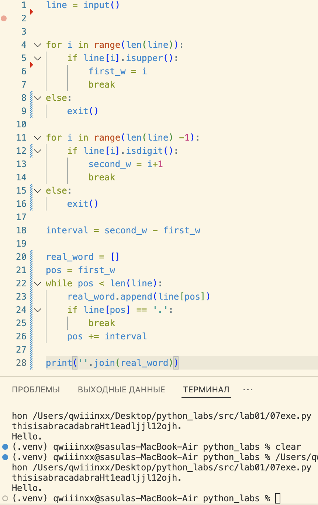


## Лабораторная 2

### Задание 1
#### 1 функция
```python
def min_max(nums: list[float | int]) -> tuple[float | int, float | int]:
    if not nums:
        raise ValueError('Список пуст')
    return (min(nums), max(nums))
```

#### 2 функция
```python
def unique_sorted(nums: list[float | int]) -> list[float | int]:
    if nums == []:
        return []
    else:
        return sorted(set(nums))
```
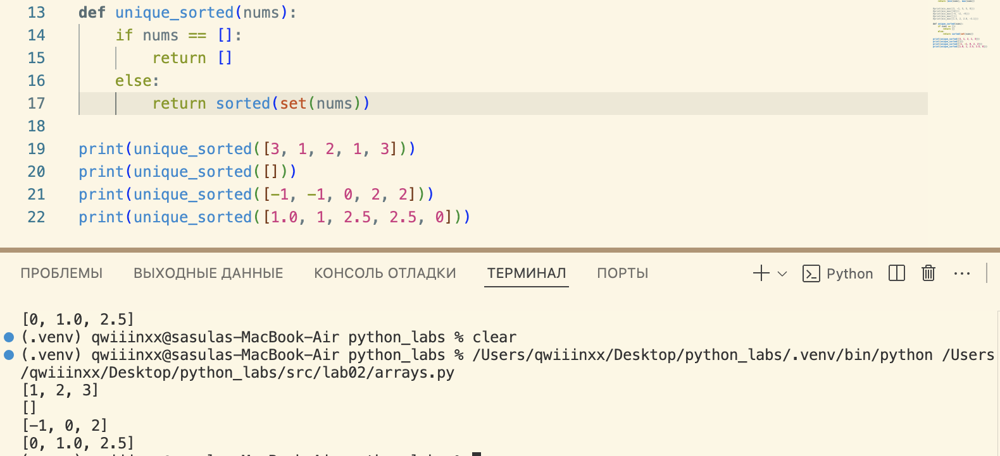
#### 3 функция
```python
def flatten(mat: list[list | tuple]) -> list:
    result = []
    for i in mat:
        if not isinstance(i, (tuple, list)):
            raise TypeError('строка не строка строк матрицы')
        result.extend(i)
    return result
```
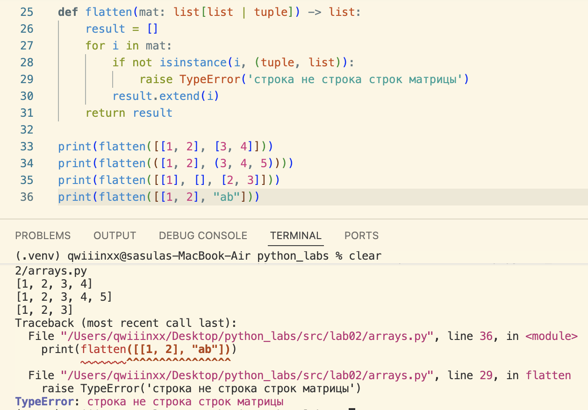


### Задание B
#### 1 функция
```python
def transpose(mat: list[list[float | int]]) -> list[list]:
    if mat == []:
        return []
    
    n_len = len(mat[0])
    for n in mat:
        if len(n) != n_len:
            raise ValueError('рваная матрица')
    
    return [list(j) for j in zip(*mat)]
```
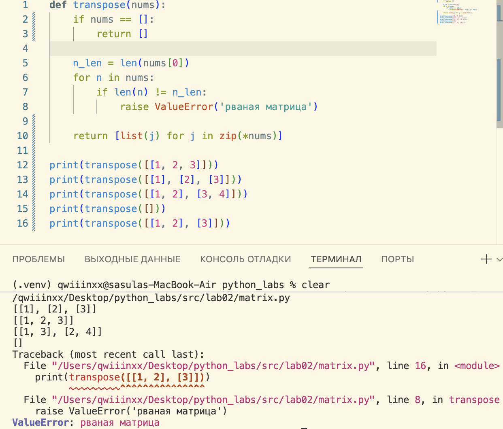
#### 2 функция
```python
def row_sums(mat: list[list[float | int]]) -> list[float]:
    n_len = len(mat[0])
    for n in mat:
        if len(n) != n_len:
            raise ValueError('рваная')
    
    result = []
    for i in mat:
        result.append(sum(i))
    return result
```
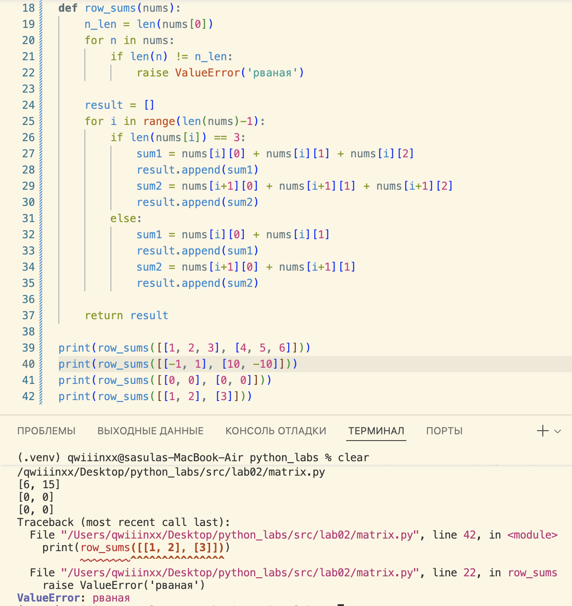
#### 3 функция
```python
def col_sums(mat: list[list[float | int]]) -> list[float]:
    n_len = len(mat[0])
    for n in mat:
        if len(n) != n_len:
            raise ValueError('рваная')
    
    result = []
    for i in range(n_len):
        col_sum = 0    
        for j in range(len(mat)):
            col_sum += mat[j][i]
        result.append(col_sum)
    return result

print(col_sums([[1, 2, 3], [4, 5, 6]])) # [5, 7, 9]
print(col_sums([[1, 3, 3], [1, 1, 1], [1, 1, 1]]))
print(col_sums([[-1, 1], [10, -10]])) # [9, -9]
print(col_sums([[0, 0], [0, 0]])) # [0, 0]
print(col_sums([[1, 2], [3]]))

```
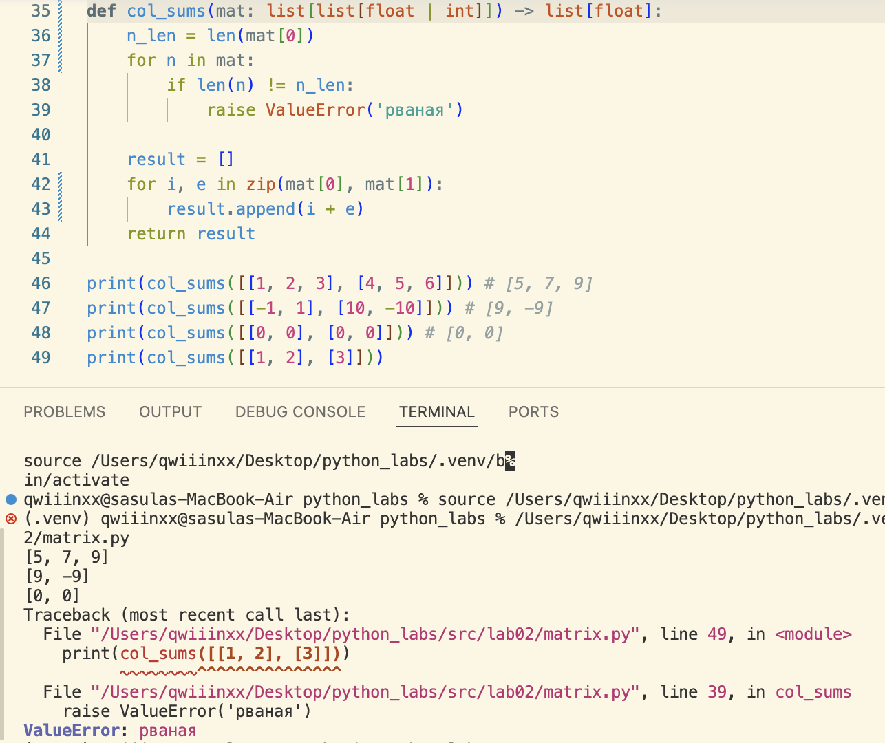


### Задание С
```python
def format_record(rec: tuple[str, str, float]) -> str:

    if not isinstance(rec, tuple):                          # ошибки на кортеж
        raise TypeError("нужен кортеж")
    
    if len(rec) != 3:
        raise ValueError("нужно 3 элемента")
    
    fio, group, gpa = rec

    if not isinstance(fio, str) or not isinstance(group, str):   # ошибки на данные
        raise TypeError("данные должны быть строкой")
    
    if not isinstance(gpa, float):
        raise TypeError("данные должны быть вещественным числом")

    if not fio:                                              # ошибки на пустоту
        raise ValueError("нельзя оставлять пустым")

    if not group:
        raise ValueError("нельзя оставлять пустым")
    
    if not gpa:
        raise ValueError("нельзя оставлять пустым")
    
    parts = fio.strip().split()                        # ['иванов', 'иван', 'иванович']
    if len(parts) < 2:
        raise ValueError("должны быть хотя бы фамилия и имя")

    surname = parts[0].title()                                      # [Иванов]
    initials = "".join(p[0].upper() + '.' for p in parts[1:])       # "Иванов И.И."

    group = group.strip()

    gpa = f"{float(gpa):.2f}"
    return f"{surname} {initials}, гр. {group}, GPA {gpa}"

# print(format_record(("Иванов Иван Иванович", "BIVT-25", 4)))
print(format_record(("Иванов Иван Иванович", "BIVT-25", 4.6)))
print(format_record(("Петров Пётр", "IKBO-12", 5.0)))
print(format_record(("Петров Пётр Петрович", "IKBO-12", 5.0)))
print(format_record(("  сидорова  анна   сергеевна ", "ABB-01", 3.999)))
```
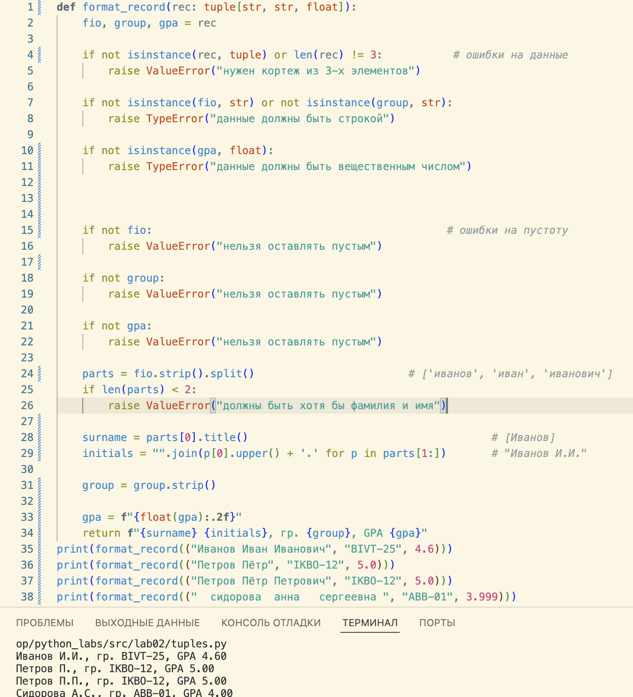

#### Пример с ошибкой TypeError
гпа вводим не вещественное
```python
print(format_record(("Иванов Иван Иванович", "BIVT-25", 4)))
```


# Лабораторная 3
#### функция normalize
```python
def normalize(text: str, *, casefold: bool = True, yo2e: bool = True) -> str:
    s = text.strip()
    if casefold:
        s = s.casefold()
    
    if yo2e:
        s = s.replace('ё', 'е').replace('Ё', 'е')

    s = " ".join(s.split())
    return s

print(normalize("ПрИвЕт\nМИр\t")) # "привет, мир"
print(normalize("ёжик, Ёлка")) # "ежик, елка"
print(normalize("Hello\r\nWorld")) # "hello world"
print(normalize("  двойные   пробелы  ")) # "двойные пробелы"
```


#### функция tokenize
```python
def tokenize(text: str) -> list[str]:
    result = []
    word = ''
    for i, w in enumerate(text):
        if w.isalnum() or w == '_':
            word += w
        elif w == '-' and word and i + 1 < len(text) and text[i+1].isalnum():
            word += w
        else:
            if word:
                result.append(word)
                word = ''
    if word:
        result.append(word)
    return result

print(tokenize("привет мир"))
print(tokenize("hello,world!!!"))
print(tokenize("по-настоящему круто"))
print(tokenize("2025 год"))
print(tokenize("emoji 😀 не слово"))
```


#### функция count_freq
```python
def count_freq(tokens: list[str]) -> dict[str, int]:
    result = {}
    for i in tokens:
        result[i] = result.get(i, 0) + 1
    return result

print(count_freq(["a","b","a","c","b","a"]))
print(count_freq(["bb", "aa", "bb", "aa", "cc"]))
```


#### функция top_n
```python
def top_n(freq: dict[str, int], n: int = 5) -> list[tuple[str, int]]:
    items = list(freq.items())
    items.sort(key=lambda x: (-x[1], x[0]))  # сначала по частоте, потом по слову
    return items[:n]

print(top_n({"a":3,"b":2,"c":1}, n=2)) # [('a', 3), ('b', 2)]
print(top_n({"aa":2,"bb":2,"cc":1}, n=2)) # [('aa', 2), ('bb', 2)]
print(top_n({"x":5,"y":5,"a":5}, n=3))
```


## Задание В
вводим в терминал строчку из слов и нажимаем control + D
```python
import sys, os # НАЖАТЬ control + D 
sys.path.append(os.path.abspath(os.path.join(os.path.dirname(__file__), "../..")))
from src.lib.text import normalize, tokenize, count_freq, top_n

def main():
    # читаем весь ввод (до EOF)
    text = sys.stdin.read()

    # нормализация
    norm_text = normalize(text)

    # токенизация
    tokens = tokenize(norm_text)

    # частоты
    freq = count_freq(tokens)

    # топ 5
    top = top_n(freq, n=5)

    print(f"Всего слов: {len(tokens)}")
    print(f"Уникальных слов: {len(freq)}")
    print("Топ-5:")
    for word, count in top:
        print(f"{word}:{count}")

if __name__ == "__main__":
    main()
```


# Лабораторная 4
## Задание А
```python
from pathlib import Path
import csv
from typing import Iterable, Sequence
import sys, os
sys.path.append(os.path.abspath(os.path.join(os.path.dirname(__file__), "../..")))

# чтение файла целиком, но стоит читать построчно
def read_text(path: str | Path, encoding: str = "utf-8") -> str:
    p = Path(__file__).parent / path  # путь относительно текущего файла
    if not p.exists(): # ошибка если файл не найден
        raise FileNotFoundError(f"файл {p} не найден")
    return print(p.read_text(encoding=encoding)) # чтение файла с любой кодировкой и его вывод


def ensure_parent_dir(path: str | Path) -> None:
    p = Path(path) # путь
    p.parent.mkdir(parents=True, exist_ok=True) # создание родительской директории если ее нет   


def write_csv(rows: list[tuple | list], path: str | Path, header: tuple[str, ...] | None = None) -> None:
    p = Path(path)
    
    # проверка на одинаковую длину строк
    if rows:
        length = len(rows[0])
        for row in rows:
            if len(row) != length:
                raise ValueError("все строки должны быть одинаковой длины")
        
        if header is not None and len(header) != length:
            raise ValueError(f"длина заголовков ({len(header)}) не совпадает с длиной строк {length}")
            

    with p.open("w", newline="", encoding="utf-8") as f: # открытие и запись csv
        writer = csv.writer(f) 
        if header is not None:
            writer.writerow(header)
        writer.writerows(rows)
```

* тест 1 

в файле input.txt лежит строка, таблица не создана
```python
if __name__ == "__main__":
    txt = read_text("../../data/lab04/input.txt")
    write_csv([("word","count"),("test",3)], "data/check.csv")
```
вывелась строка из файла input.txt
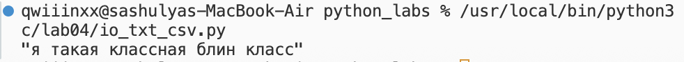
создали csv файл с таблицей
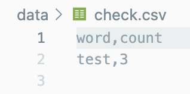

* тест 2 

записываем в таблицу только заголовок
```python
if __name__ == "__main__":
    txt = read_text("../../data/lab04/input.txt")
    write_csv([("a","b")], "data/check.csv")
```
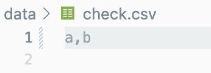

## Задание В
запуск через ```python3 -m src.lab04.text_report```
```python
from pathlib import Path
import sys, os
from src.lab04.io_txt_csv import read_text, write_csv
from src.lib.text import normalize, tokenize, count_freq

def main():
    # Формируем пути относительно корня проекта
    root = Path(os.path.abspath(os.path.join(os.path.dirname(__file__), "../..")))
    input_path = root / "data" / "lab04" / "input.txt"
    output_path = root / "data" / "lab04" / "report.csv"

    # Проверяем существование входного файла
    if not input_path.exists():
        print(f"Файл не найден: {input_path}")
        sys.exit(1)

    # Читаем текст
    text = read_text(input_path)
    if not text.strip():
        print("Пустой файл — создаю CSV только с заголовком.")
        write_csv([], output_path, header=("word", "count"))
        return

    # Обрабатываем текст
    norm_text = normalize(text)
    tokens = tokenize(norm_text)
    freqs = count_freq(tokens)

    # Сортируем результат по убыванию количества, затем по алфавиту
    sorted_rows = sorted(freqs.items(), key=lambda x: (-x[1], x[0]))

    # Пишем отчёт
    write_csv(sorted_rows, output_path, header=("word", "count"))

    # Печатаем краткий итог
    print(f"Всего слов: {len(tokens)}")
    print(f"Уникальных слов: {len(freqs)}")
    print("Топ-5:", sorted_rows[:5])


if __name__ == "__main__":
    main()
```

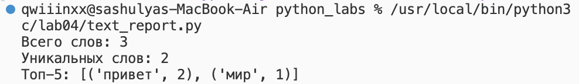