# python_labs

## Лабораторная 1

### Задание 1


### Задание 2


### Задание 3


### Задание 4


### Задание 5


### Задание 6


### Задание 7


## Лабораторная 2

### Задание 1
#### 1 функция
```python
def min_max(nums: list[float | int]) -> tuple[float | int, float | int]:
    if not nums:
        raise ValueError('Список пуст')
    return (min(nums), max(nums))
```

#### 2 функция
```python
def unique_sorted(nums: list[float | int]) -> list[float | int]:
    if nums == []:
        return []
    else:
        return sorted(set(nums))
```

#### 3 функция
```python
def flatten(mat: list[list | tuple]) -> list:
    result = []
    for i in mat:
        if not isinstance(i, (tuple, list)):
            raise TypeError('строка не строка строк матрицы')
        result.extend(i)
    return result
```


### Задание B
#### 1 функция
```python
def transpose(mat: list[list[float | int]]) -> list[list]:
    if mat == []:
        return []
    
    n_len = len(mat[0])
    for n in mat:
        if len(n) != n_len:
            raise ValueError('рваная матрица')
    
    return [list(j) for j in zip(*mat)]
```

#### 2 функция
```python
def row_sums(mat: list[list[float | int]]) -> list[float]:
    n_len = len(mat[0])
    for n in mat:
        if len(n) != n_len:
            raise ValueError('рваная')
    
    result = []
    for i in mat:
        result.append(sum(i))
    return result
```

#### 3 функция
```python
def col_sums(mat: list[list[float | int]]) -> list[float]:
    n_len = len(mat[0])
    for n in mat:
        if len(n) != n_len:
            raise ValueError('рваная')
    
    result = []
    for i in range(n_len):
        col_sum = 0    
        for j in range(len(mat)):
            col_sum += mat[j][i]
        result.append(col_sum)
    return result

print(col_sums([[1, 2, 3], [4, 5, 6]])) # [5, 7, 9]
print(col_sums([[1, 3, 3], [1, 1, 1], [1, 1, 1]]))
print(col_sums([[-1, 1], [10, -10]])) # [9, -9]
print(col_sums([[0, 0], [0, 0]])) # [0, 0]
print(col_sums([[1, 2], [3]]))

```


### Задание С
```python
def format_record(rec: tuple[str, str, float]) -> str:

    if not isinstance(rec, tuple):                          # ошибки на кортеж
        raise TypeError("нужен кортеж")
    
    if len(rec) != 3:
        raise ValueError("нужно 3 элемента")
    
    fio, group, gpa = rec

    if not isinstance(fio, str) or not isinstance(group, str):   # ошибки на данные
        raise TypeError("данные должны быть строкой")
    
    if not isinstance(gpa, float):
        raise TypeError("данные должны быть вещественным числом")

    if not fio:                                              # ошибки на пустоту
        raise ValueError("нельзя оставлять пустым")

    if not group:
        raise ValueError("нельзя оставлять пустым")
    
    if not gpa:
        raise ValueError("нельзя оставлять пустым")
    
    parts = fio.strip().split()                        # ['иванов', 'иван', 'иванович']
    if len(parts) < 2:
        raise ValueError("должны быть хотя бы фамилия и имя")

    surname = parts[0].title()                                      # [Иванов]
    initials = "".join(p[0].upper() + '.' for p in parts[1:])       # "Иванов И.И."

    group = group.strip()

    gpa = f"{float(gpa):.2f}"
    return f"{surname} {initials}, гр. {group}, GPA {gpa}"

# print(format_record(("Иванов Иван Иванович", "BIVT-25", 4)))
print(format_record(("Иванов Иван Иванович", "BIVT-25", 4.6)))
print(format_record(("Петров Пётр", "IKBO-12", 5.0)))
print(format_record(("Петров Пётр Петрович", "IKBO-12", 5.0)))
print(format_record(("  сидорова  анна   сергеевна ", "ABB-01", 3.999)))
```


#### Пример с ошибкой TypeError
гпа вводим не вещественное
```python
print(format_record(("Иванов Иван Иванович", "BIVT-25", 4)))
```


# Лабораторная 3
#### функция normalize
```python
def normalize(text: str, *, casefold: bool = True, yo2e: bool = True) -> str:
    s = text.strip()
    if casefold:
        s = s.casefold()
    
    if yo2e:
        s = s.replace('ё', 'е').replace('Ё', 'е')

    s = " ".join(s.split())
    return s

print(normalize("ПрИвЕт\nМИр\t")) # "привет, мир"
print(normalize("ёжик, Ёлка")) # "ежик, елка"
print(normalize("Hello\r\nWorld")) # "hello world"
print(normalize("  двойные   пробелы  ")) # "двойные пробелы"
```


#### функция tokenize
```python
def tokenize(text: str) -> list[str]:
    result = []
    word = ''
    for i, w in enumerate(text):
        if w.isalnum() or w == '_':
            word += w
        elif w == '-' and word and i + 1 < len(text) and text[i+1].isalnum():
            word += w
        else:
            if word:
                result.append(word)
                word = ''
    if word:
        result.append(word)
    return result

print(tokenize("привет мир"))
print(tokenize("hello,world!!!"))
print(tokenize("по-настоящему круто"))
print(tokenize("2025 год"))
print(tokenize("emoji 😀 не слово"))
```


#### функция count_freq
```python
def count_freq(tokens: list[str]) -> dict[str, int]:
    result = {}
    for i in tokens:
        result[i] = result.get(i, 0) + 1
    return result

print(count_freq(["a","b","a","c","b","a"]))
print(count_freq(["bb", "aa", "bb", "aa", "cc"]))
```


#### функция top_n
```python
def top_n(freq: dict[str, int], n: int = 5) -> list[tuple[str, int]]:
    items = list(freq.items())
    items.sort(key=lambda x: (-x[1], x[0]))  # сначала по частоте, потом по слову
    return items[:n]

print(top_n({"a":3,"b":2,"c":1}, n=2)) # [('a', 3), ('b', 2)]
print(top_n({"aa":2,"bb":2,"cc":1}, n=2)) # [('aa', 2), ('bb', 2)]
print(top_n({"x":5,"y":5,"a":5}, n=3))
```


## Задание В
вводим в терминал строчку из слов и нажимаем control + D
```python
import sys, os # НАЖАТЬ control + D 
sys.path.append(os.path.abspath(os.path.join(os.path.dirname(__file__), "../..")))
from src.lib.text import normalize, tokenize, count_freq, top_n

def main():
    # читаем весь ввод (до EOF)
    text = sys.stdin.read()

    # нормализация
    norm_text = normalize(text)

    # токенизация
    tokens = tokenize(norm_text)

    # частоты
    freq = count_freq(tokens)

    # топ 5
    top = top_n(freq, n=5)

    print(f"Всего слов: {len(tokens)}")
    print(f"Уникальных слов: {len(freq)}")
    print("Топ-5:")
    for word, count in top:
        print(f"{word}:{count}")

if __name__ == "__main__":
    main()
```


# Лабораторная 4
## Задание А
## **read_text**
```python
def read_text(path: str | Path, encoding: str = "utf-8") -> str:
    p = Path(__file__).parent / path 
    if not p.exists():
        raise FileNotFoundError(f"файл {p} не найден")
    return p.read_text(encoding=encoding)
```
## **write_csv**
```python
def write_csv(rows: list[tuple | list], path: str | Path, header: tuple[str, ...] | None = None) -> None:
    p = Path(path)
    
    if rows:
        length = len(rows[0])
        for row in rows:
            if len(row) != length:
                raise ValueError("все строки должны быть одинаковой длины")
        
        if header is not None and len(header) != length:
            raise ValueError(f"длина заголовков ({len(header)}) не совпадает с длиной строк {length}")
            

    with p.open("w", newline="", encoding="utf-8") as f:
        writer = csv.writer(f)
        if header is not None:
            writer.writerow(header)
        writer.writerows(rows)
```
## **ensure_parent_dir**
```python
def ensure_parent_dir(path: str | Path) -> None:
    p = Path(path)
    p.parent.mkdir(parents=True, exist_ok=True)
```
### тест функций № 1
```python
from src.io_txt_csv import read_text, write_csv
txt = read_text("data/input.txt")  # должен вернуть строку
write_csv([("word","count"),("test",3)], "data/check.csv")  # создаст CSV
```
1) создался csv

2)  запринтила строку, которую возвращает (для наглядности)

### тест функций № 2
```python
from src.io_txt_csv import read_text, write_csv
txt = read_text("../../data/lab04/input.txt")
    write_csv([("a","b")], "data/check.csv")
```
создастся csv только с заголовками

### тест функции № 3
``` input.txt ``` пустой -> возвращает **пустую** строку
### тест функций № 4
пробуем запихать ```input.pdf``` в csv: выдаёт ValueError т.к. ожидаем расширение txt
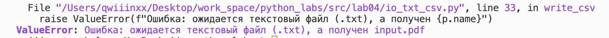
### файл очень большой
- допускается читать целиком
- в реале стоит читать построчно

## Задание В
запуск через ```python3 -m src.lab04.text_report```
```python
from pathlib import Path
import sys, os
from src.lab04.io_txt_csv import read_text, write_csv
from src.lib.text import normalize, tokenize, count_freq

def main():
    # формируем пути относительно корня проекта
    root = Path(os.path.abspath(os.path.join(os.path.dirname(__file__), "../..")))
    input_path = root / "data" / "lab04" / "input.txt"
    output_path = root / "data" / "lab04" / "report.csv"

    # проверяем существование входного файла
    if not input_path.exists():
        print(f"Файл не найден: {input_path}")
        sys.exit(1)

    # читаем текст
    text = read_text(input_path)
    if not text.strip():
        print("Пустой файл — создаю CSV только с заголовком.")
        write_csv([], output_path, header=("word", "count"))
        return

    # обрабатываем текст
    norm_text = normalize(text)
    tokens = tokenize(norm_text)
    freqs = count_freq(tokens)

    # сортируем результат по убыванию количества, затем по алфавиту
    sorted_rows = sorted(freqs.items(), key=lambda x: (-x[1], x[0]))

    # пишем отчёт
    write_csv(sorted_rows, output_path, header=("word", "count"))

    # печатаем итог
    print(f"Всего слов: {len(tokens)}")
    print(f"Уникальных слов: {len(freqs)}")
    print("Топ-5:", sorted_rows[:5])


if __name__ == "__main__":
    main()
```
## Тест-кейсы:
### A) вход ```data/input.txt```
Консоль:

report.csv:
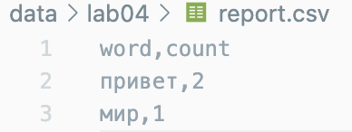

### B) пустой файл
пустой ```data/input.txt```
консоль:
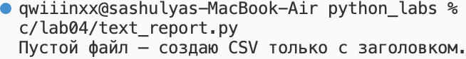
report.csv:
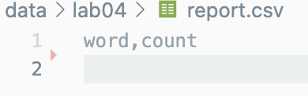


### C) Кодировка cp1251
вход ```data/input.txt``` в **cp1251** с текстом ```"Привет"```
вход через: ```python3 src/lab04/text_report.py --in data/input.txt --encoding cp1251```
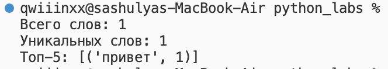


# Лабораорная № 5
## Задание А
## `json_to_csv`
```python
def json_to_csv(json_path: str, csv_path: str) -> None:
    json_path = Path(json_path)
    csv_path = Path(csv_path)

    # проверки
    if not json_path.exists():
        raise FileNotFoundError(f"файл не найден")
    if json_path.suffix.lower() != ".json":
        raise ValueError(f"ошибка: ожидается JSON-файл, а получен {json_path.suffix}")

    # читаем JSON
    with json_path.open(encoding="utf-8") as f:
        try:
            data = json.load(f)
        except json.JSONDecodeError as e:
            raise ValueError(f"ошибка чтения json: {e}")

    # проверка содержимого
    if not data or not isinstance(data, list):
        raise ValueError("Пустой JSON или неподдерживаемая структура (ожидается список словарей)")
    if not all(isinstance(item, dict) for item in data):
        raise ValueError("Все элементы JSON должны быть словарями")

    # определяем заголовки (ключи)
    # можно отсортировать по первому объекту или по алфавиту
    fieldnames = sorted({key for obj in data for key in obj.keys()})

    # запись CSV
    csv_path.parent.mkdir(parents=True, exist_ok=True)
    with csv_path.open("w", newline="", encoding="utf-8") as f:
        writer = csv.DictWriter(f, fieldnames=fieldnames)
        writer.writeheader()
        for row in data:
            writer.writerow(row)
```
### Тест № 1
#### запись из JSON в CSV
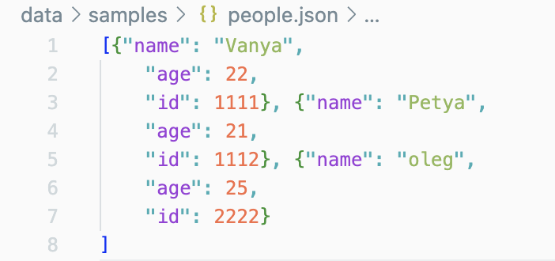
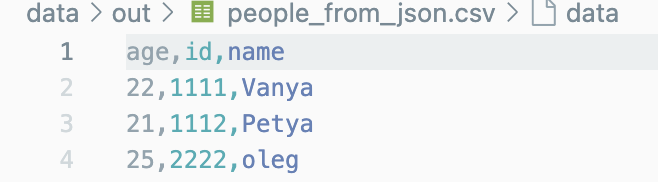
### Тест № 2
#### неверный тип файла, пустой JSON 
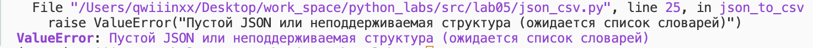


## `csv_to_json`
```python
def csv_to_json(csv_path: str, json_path: str) -> None:
    csv_path = Path(csv_path)
    json_path = Path(json_path)

    # проверки
    if not csv_path.exists():
        raise FileNotFoundError(f"Файл не найден: {csv_path}")
    if csv_path.suffix.lower() != ".csv":
        raise ValueError(f"Ошибка: ожидается CSV-файл, а получен {csv_path.suffix}")

    # читаем CSV
    with csv_path.open(encoding="utf-8") as f:
        reader = csv.DictReader(f)
        if reader.fieldnames is None:
            raise ValueError("CSV-файл не содержит заголовка")
        data = list(reader)

    if not data:
        raise ValueError("Пустой CSV-файл")

    # записываем JSON
    json_path.parent.mkdir(parents=True, exist_ok=True)
    with json_path.open("w", encoding="utf-8") as f:
        json.dump(data, f, ensure_ascii=False, indent=2)
```
### Тест № 1
## запись из CSV в JSON
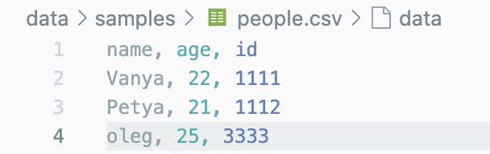
=
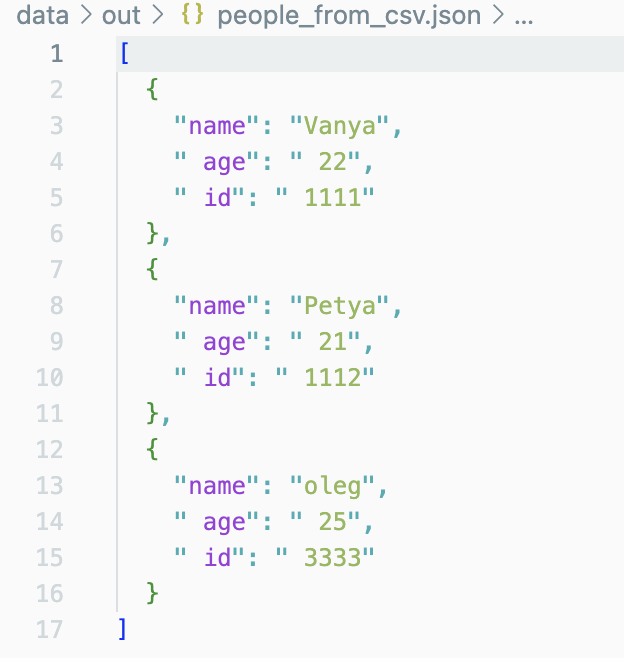

### Тест № 2
#### пустой CSV 
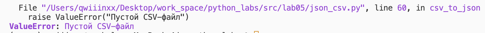

### Тест № 3
#### отсутствующий CSV файл
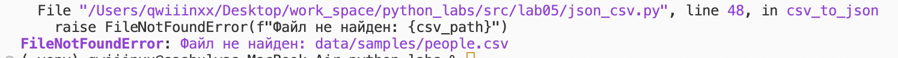
## Задание В
## `csv_to_xlsx`

```python
def csv_to_xlsx(csv_path: str, xlsx_path: str) -> None:
    csv_path = Path(csv_path)
    xlsx_path = Path(xlsx_path)

    # проверка входного файла
    if not csv_path.exists():
        raise FileNotFoundError(f"файл не найден: {csv_path}")
    if csv_path.suffix.lower() != ".csv":
        raise ValueError("ошибка: ожидается входной файл с расширением .csv")

    # проверка выходного файла
    if xlsx_path.suffix.lower() != ".xlsx":
        raise ValueError("ошибка: выходной файл должен иметь расширение .xlsx")

    # чтение CSV
    with csv_path.open(encoding="utf-8") as f:
        reader = csv.reader(f)
        rows = list(reader)

    if not rows:
        raise ValueError("ошибка: CSV пустой")
    if not any(rows[0]):
        raise ValueError("ошибка: CSV не содержит заголовков")

    # Создание Excel-файла
    wb = Workbook()
    ws = wb.active
    ws.title = "Sheet1"

    for row in rows:
        ws.append(row)

    # автоширина колонок
    for column_cells in ws.columns:
        max_length = 0
        column_letter = column_cells[0].column_letter  # A, B, C, ...
        for cell in column_cells:
            value = str(cell.value) if cell.value is not None else ""
            max_length = max(max_length, len(value))
        adjusted_width = max(max_length + 2, 8)  # минимум 8 символов
        ws.column_dimensions[column_letter].width = adjusted_width

    os.makedirs(os.path.dirname(xlsx_path), exist_ok=True)
    # сохранение
    wb.save(xlsx_path)

if __name__ == "__main__":
    csv_to_xlsx("data/samples/cities.csv", "data/out/cities.xlsx")
    print("всё норм")
```
## Тест № 1
#### когда всё работает, имеем cities.csv 
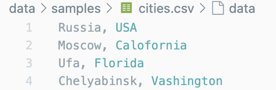 
#### получили XLSX с таблицей 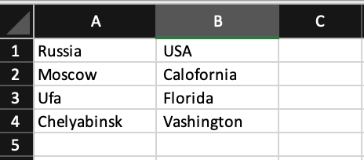

## Тест № 2
#### когда пустой CSV
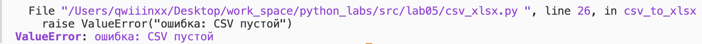

## Тест № 3
#### когда файл отсутсвует
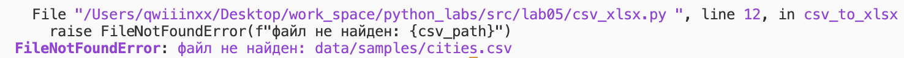


# Лабораторная № 6
# **argparse**
## ```Модуль cli_text.py```
### Подкоманды **stats** / **cat**
```python
import argparse
from src.lib.text import normalize, tokenize, count_freq, top_n

def main():
    parser = argparse.ArgumentParser(description="Пример CLI")
    subparsers = parser.add_subparsers(dest="command")

    # подкоманда stats
    stats_parser = subparsers.add_parser("stats", help="Частоты слов")
    stats_parser.add_argument("--input", required=True, help="Входной файл")
    stats_parser.add_argument("--top", type=int, default=5, help="Количество топ-n")

    # подкоманда cat
    cat_parser = subparsers.add_parser("cat", help="Вывести содержимое файла")
    cat_parser.add_argument("--input", required=True, help="Входной файл")
    cat_parser.add_argument("-n", action="store_true", help="Нумеровать строки")

    args = parser.parse_args()

    if args.command == "stats":
        try:
            with open(args.input, "r", encoding="utf-8") as f:
                text = f.read()
        except FileNotFoundError:
            parser.error(f"Файл не найден")
        if not text:
            parser.error("Входной файл пуст")

        norm_text = normalize(text)
        tokens = tokenize(norm_text)
        freq = count_freq(tokens)
        top = top_n(freq, n=args.top)

        print(f"Всего слов: {len(tokens)}")
        print(f"Уникальных слов: {len(freq)}")
        print("Топ-{}:".format(args.top))
        for word, count in top:
            print(f"{word}:{count}")

    elif args.command == "cat":
        try:
            with open(args.input, "r", encoding="utf-8") as f:
                for i, line in enumerate(f, start=1):
                    if args.n:
                        print(f"{i}\t{line}", end="")
                    else:
                        print(line, end="")
        except FileNotFoundError:
            parser.error(f"Файл не найден")
        
if __name__ == "__main__":
    main()
```
## Примеры:
### запуск **stats** через ```python3 -m src.lab06.cli_text stats --input data/samples/test_stats.txt --top 5```

терминал:
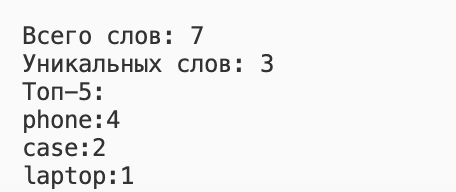

---
### запуск **cat** через ```python3 -m src.lab06.cli_text cat --input data/samples/test_cat.txt -n```

терминал: 
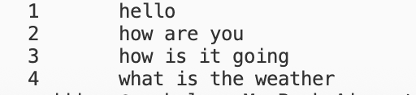
---

#### Каждую команду можно вызвать с --help
### ```python3 -m src.lab06.cli_text stats --help```
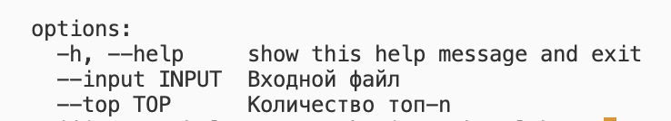

### ```python3 -m src.lab06.cli_text cat --help```
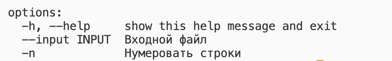


---
#### Пустой входной файл ----> parser.error(...)
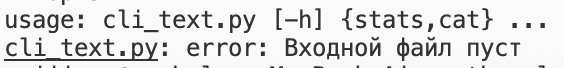
---
#### Отсутствие входного файла ----> parser.error(...)
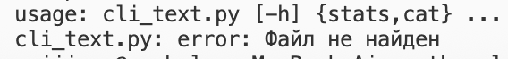
---
## ```Модуль cli_convert.py```
```python
import argparse
from src.lab05.json_csv import json_to_csv, csv_to_json
from src.lab05.csv_xlsx import csv_to_xlsx


def main():
    parser = argparse.ArgumentParser(description="Конвертация между json, csv и xlsx")
    subparsers = parser.add_subparsers(dest="command")

    # подкоманда json2csv
    parser_j2c = subparsers.add_parser("json2csv", help="Конвертация json в csv")
    parser_j2c.add_argument("--input", required=True, help="Входной json файл")
    parser_j2c.add_argument("--output", required=True, help="Финальный csv файл")

    # подкоманда csv2json
    parser_c2j = subparsers.add_parser("csv2json", help="Конвертация csv в json")
    parser_c2j.add_argument("--input", required=True, help="Входной csv файл")
    parser_c2j.add_argument("--output", required=True, help="Финальный json файл")

    # подкоманда csv2xlsx
    parser_c2x = subparsers.add_parser("csv2xlsx", help="Конвертация csv в xlsx")
    parser_c2x.add_argument("--input", required=True, help="Входной csv файл")
    parser_c2x.add_argument("--output", required=True, help="Финальный xlsx файл")

    args = parser.parse_args()

    if args.command == "json2csv":
        try:
            json_to_csv(args.input, args.output)
            print("Каонвертация завершена")
        except FileNotFoundError:
            parser.error("Входной файл не найден")
    
    elif args.command == "csv2json":
        try: 
            csv_to_json(args.input, args.output)
            print("Конвертация завершена")
        except FileNotFoundError:
            parser.error("Входной файл не найден")

    elif args.command == "csv2xlsx":
        try:
            csv_to_xlsx(args.input, args.output)
            print("Конвертация завершена")
        except FileNotFoundError:
            parser.error("Входной файл не найден")

    elif args.command not in ["json2csv", "csv2json", "csv2xlsx"]:
        parser.error("Неизвестная подкоманда")
        
if __name__ == "__main__":
    main()
```
### Запуск **json2csv** через ```python3 -m src.lab06.cli_convert json2csv --input data/samples/people.json --output data/out/people_from_json.csv```
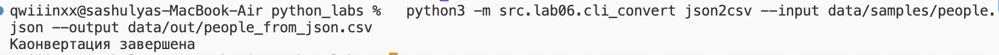

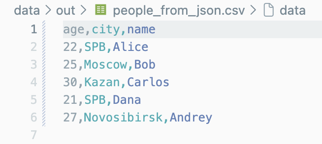
---
### Запуск **csv2json** через ```python3 -m src.lab06.cli_convert csv2json --input data/samples/people.csv --output data/out/people_from_csv.json```
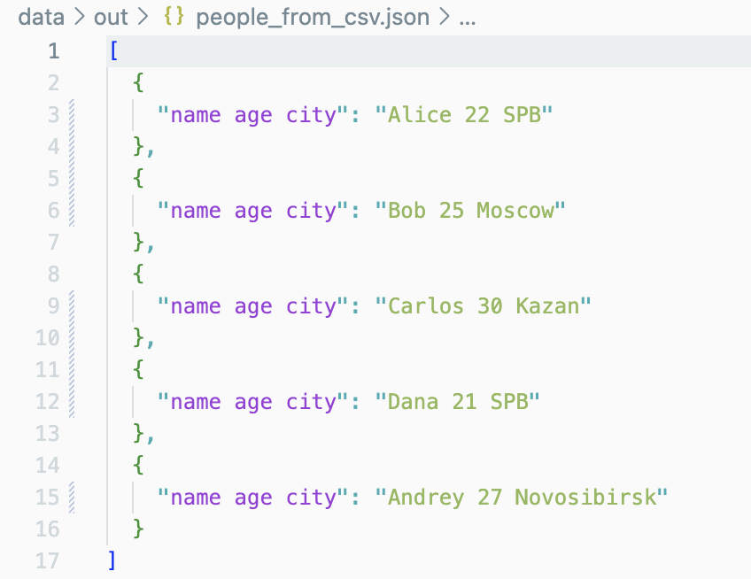
---
### Запуск **csv2xlsx** через ```python3 -m src.lab06.cli_convert csv2xlsx --input data/samples/cities.csv --output data/out/cities.xlsx```
терминал:
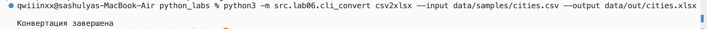
таблица:
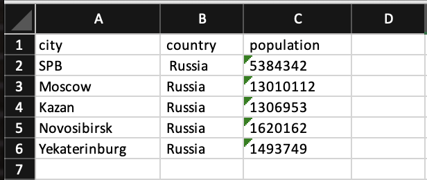

### Проверка --help глобально
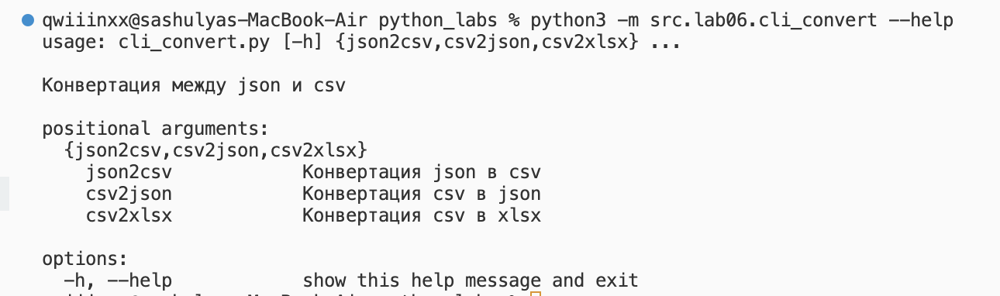
### Проверка --help json2csv
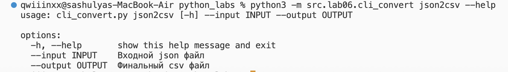
### Проверка --help csv2json
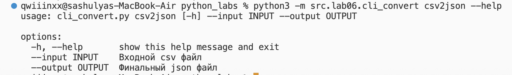
### Проверка --help csv2xlsx
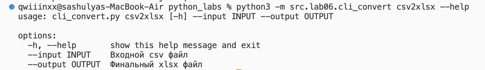

# Лабраторная № 7
## Пути к лабе: `src/lab07/README.md`

# Лабораорная № 8
## Пути к к лабе: `src/lab08/README.md`

# Лабораторная № 9
## База данных на CSV: класс Group, CRUD-операции и CLI

## Задание А: Класс Group

### Основные методы

#### `__init__(storage_path)`
Инициализация группы с путём к CSV-файлу. Автоматически создаёт файл с заголовком, если его нет

```python
from src.lab09.group import Group

group = Group('data/lab09/students.csv')
```

#### `list() -> list[Student]`
Возвращает всех студентов в виде списка объектов Student
---
data:
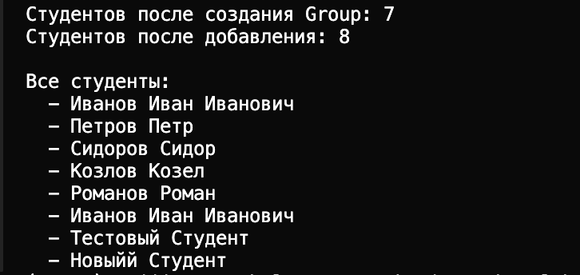
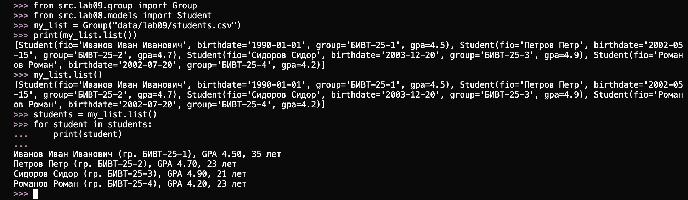


#### `add(student: Student)`
Добавляет нового студента в CSV

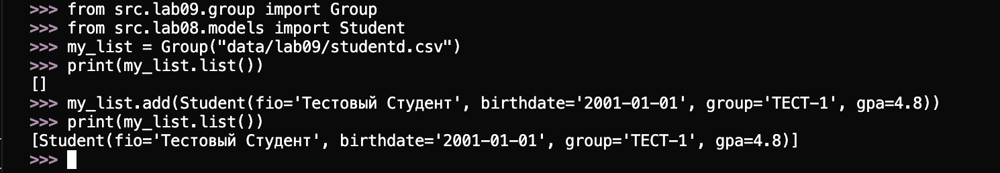

#### `find(substr: str) -> list[dict]`
Находит студентов по подстроке в ФИО. Возвращает список словарей
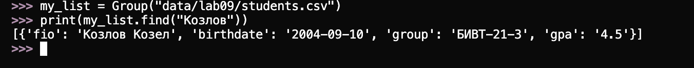


#### `remove(fio: str)`
Удаляем Иванова Ивана Ивановича (удаляет первую найденную запись).


#### `update(fio: str, **fields) -> bool`
**Обновляет поля существующего студента**

Было:

**Меняем Иванова Ивана Ивановича (gpa, group):**

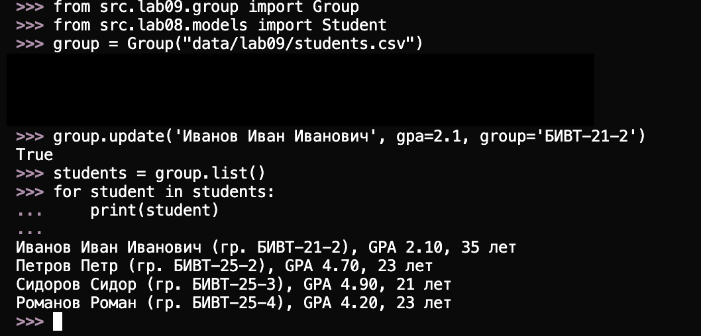

### Вспомогательные методы

#### `_read_all() -> list[dict]`
Читает все строки из CSV и возвращает их как список словарей

#### `_write_all(rows: list[dict])`
Записывает все строки в CSV

#### `_ensure_storage_exists()`
Создаёт файл с заголовком, если его ещё нет. Не перезаписывает существующий файл, сохраняя все данные!!!

### Полный пример использования

```python
from src.lab09.group import Group
from src.lab08.models import Student

# Создаём группу
group = Group('data/lab09/students.csv')

# Добавляем студентов
student1 = Student('Иванов Иван', '2003-10-10', 'БИВТ-21-1', 4.3)
student2 = Student('Петров Петр', '2002-05-15', 'БИВТ-21-2', 4.7)
student3 = Student('Сидорова Анна', '2003-12-20', 'БИВТ-21-1', 4.9)

group.add(student1)
group.add(student2)
group.add(student3)

# Получаем список всех студентов
all_students = group.list()
print(f'Всего студентов: {len(all_students)}')

# Поиск по подстроке
found = group.find('Иванов')
print(f'Найдено студентов с "Иванов": {len(found)}')
for record in found:
    print(record)

# Обновление данных
group.update('Иванов Иван', gpa=4.5)
updated_records = group.find('Иванов')
if updated_records:
    print(f'Обновлённый GPA: {updated_records[0]["gpa"]}')

# Удаление студента
group.remove('Петров Петр')
print(f'После удаления: {len(group.list())} студентов')
```

## Задание ★: Метод stats()

### `stats() -> dict`

Возвращает словарь со статистикой:
- `count` — общее количество студентов
- `min_gpa` — минимальный GPA
- `max_gpa` — максимальный GPA
- `avg_gpa` — средний GPA
- `groups` — словарь с количеством студентов по группам
- `top_5_students` — топ-5 студентов по GPA

```python
stats = group.stats()
print(f"Всего студентов: {stats['count']}")
print(f"Средний GPA: {stats['avg_gpa']:.2f}")
print(f"Минимальный GPA: {stats['min_gpa']}")
print(f"Максимальный GPA: {stats['max_gpa']}")
print(f"Распределение по группам: {stats['groups']}")
print("Топ-5 студентов:")
for student in stats['top_5_students']:
    print(f"  {student['fio']}: {student['gpa']}")
```
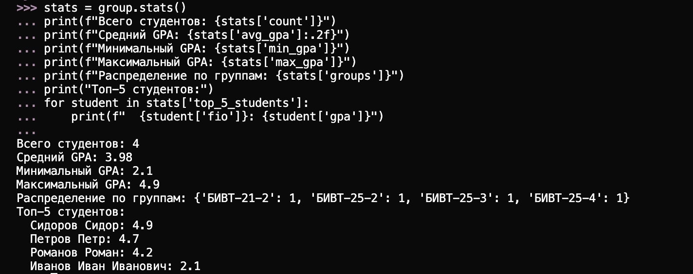