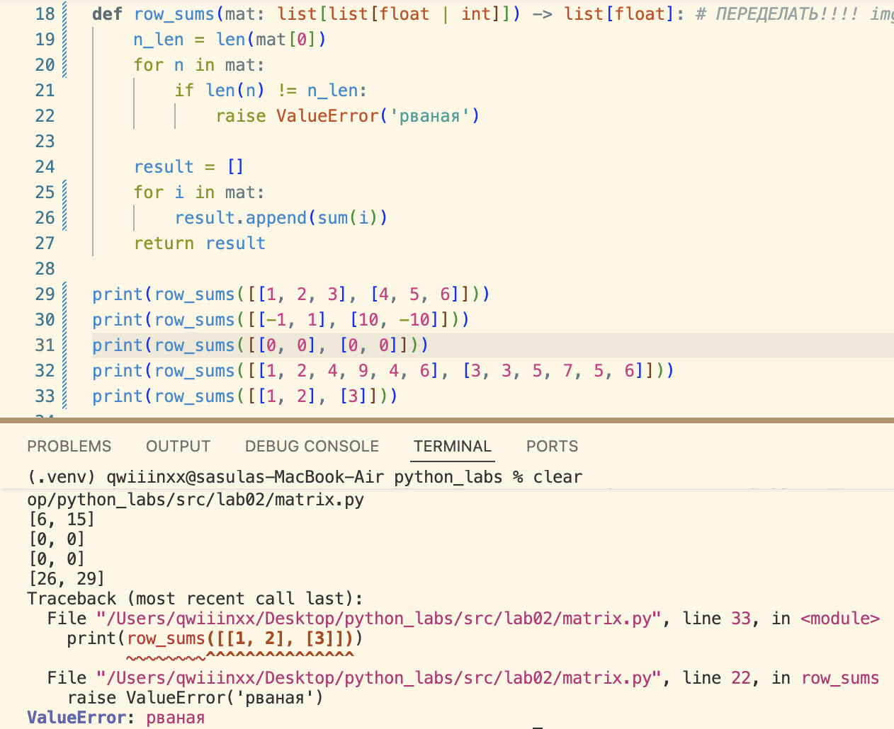
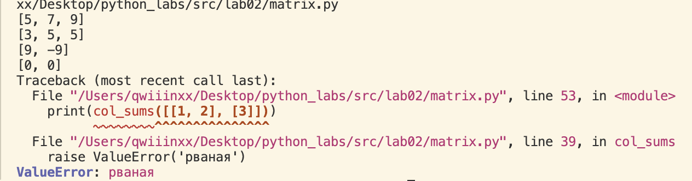
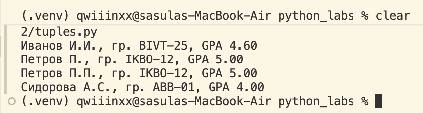
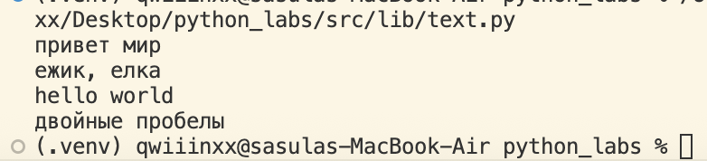

# python_labs

## Лабораторная 1

### Задание 1


### Задание 2


### Задание 3


### Задание 4


### Задание 5


### Задание 6


### Задание 7


## Лабораторная 2

### Задание 1
#### 1 функция
```python
def min_max(nums: list[float | int]) -> tuple[float | int, float | int]:
    if not nums:
        raise ValueError('Список пуст')
    return (min(nums), max(nums))
```

#### 2 функция
```python
def unique_sorted(nums: list[float | int]) -> list[float | int]:
    if nums == []:
        return []
    else:
        return sorted(set(nums))
```

#### 3 функция
```python
def flatten(mat: list[list | tuple]) -> list:
    result = []
    for i in mat:
        if not isinstance(i, (tuple, list)):
            raise TypeError('строка не строка строк матрицы')
        result.extend(i)
    return result
```


### Задание B
#### 1 функция
```python
def transpose(mat: list[list[float | int]]) -> list[list]:
    if mat == []:
        return []
    
    n_len = len(mat[0])
    for n in mat:
        if len(n) != n_len:
            raise ValueError('рваная матрица')
    
    return [list(j) for j in zip(*mat)]
```

#### 2 функция
```python
def row_sums(mat: list[list[float | int]]) -> list[float]:
    n_len = len(mat[0])
    for n in mat:
        if len(n) != n_len:
            raise ValueError('рваная')
    
    result = []
    for i in mat:
        result.append(sum(i))
    return result
```

#### 3 функция
```python
def col_sums(mat: list[list[float | int]]) -> list[float]:
    n_len = len(mat[0])
    for n in mat:
        if len(n) != n_len:
            raise ValueError('рваная')
    
    result = []
    for i, e in zip(mat[0], mat[1]):
        result.append(i + e)
    return result
```



### Задание С
```python
def format_record(rec: tuple[str, str, float]) -> str:

    if not isinstance(rec, tuple):                          # ошибки на кортеж
        raise TypeError("нужен кортеж")
    
    if len(rec) != 3:
        raise ValueError("нужно 3 элемента")
    
    fio, group, gpa = rec

    if not isinstance(fio, str) or not isinstance(group, str):   # ошибки на данные
        raise TypeError("данные должны быть строкой")
    
    if not isinstance(gpa, float):
        raise TypeError("данные должны быть вещественным числом")

    if not fio:                                              # ошибки на пустоту
        raise ValueError("нельзя оставлять пустым")

    if not group:
        raise ValueError("нельзя оставлять пустым")
    
    if not gpa:
        raise ValueError("нельзя оставлять пустым")
    
    parts = fio.strip().split()                        # ['иванов', 'иван', 'иванович']
    if len(parts) < 2:
        raise ValueError("должны быть хотя бы фамилия и имя")

    surname = parts[0].title()                                      # [Иванов]
    initials = "".join(p[0].upper() + '.' for p in parts[1:])       # "Иванов И.И."

    group = group.strip()

    gpa = f"{float(gpa):.2f}"
    return f"{surname} {initials}, гр. {group}, GPA {gpa}"

# print(format_record(("Иванов Иван Иванович", "BIVT-25", 4)))
print(format_record(("Иванов Иван Иванович", "BIVT-25", 4.6)))
print(format_record(("Петров Пётр", "IKBO-12", 5.0)))
print(format_record(("Петров Пётр Петрович", "IKBO-12", 5.0)))
print(format_record(("  сидорова  анна   сергеевна ", "ABB-01", 3.999)))
```


#### Пример с ошибкой TypeError
гпа вводим не вещественное
```python
print(format_record(("Иванов Иван Иванович", "BIVT-25", 4)))
```


## Лабораторная 3
### Задание А
функция normalize

функция tokenize

функция top_n


### Задание В
