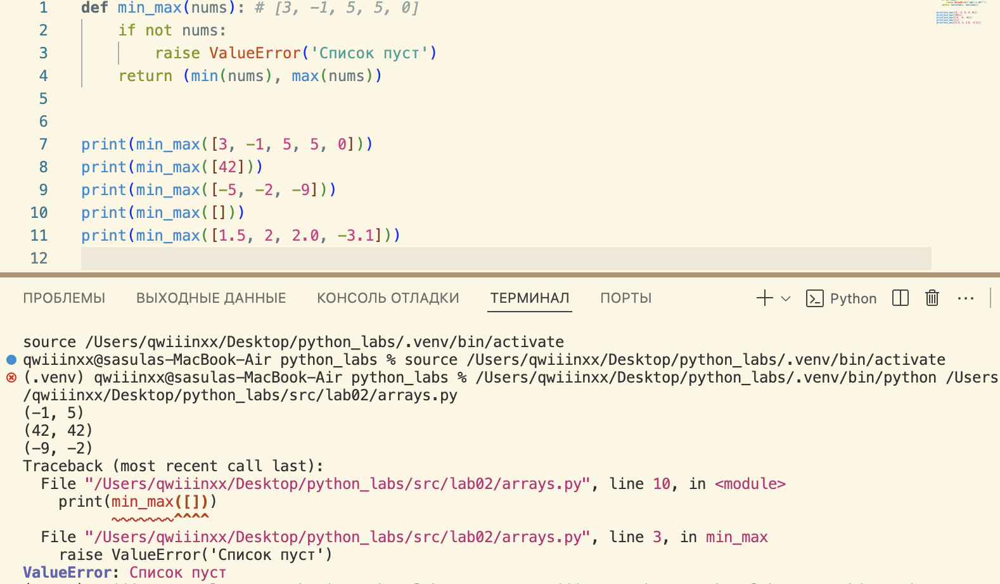

# python_labs

## Лабораторная 1

### Задание 1

### Задание 2

### Задание 3

### Задание 4

### Задание 5

### Задание 6

### Задание 7

## Лабораторная 2

### Задание 1
#### 1 функция

#### 2 функция

#### 3 функция

### Задание 2
