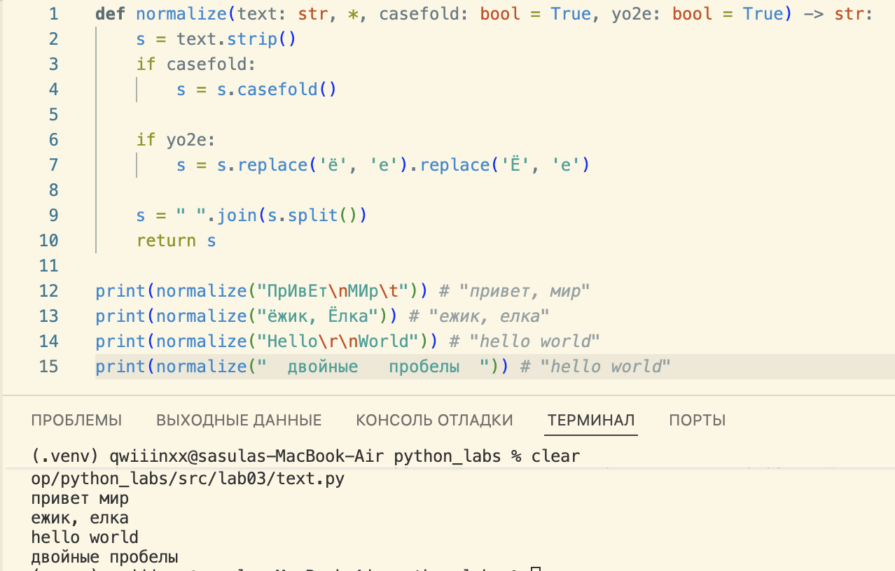
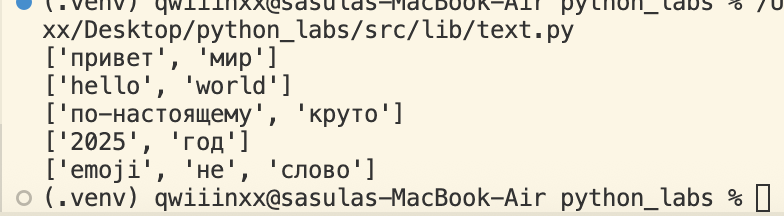
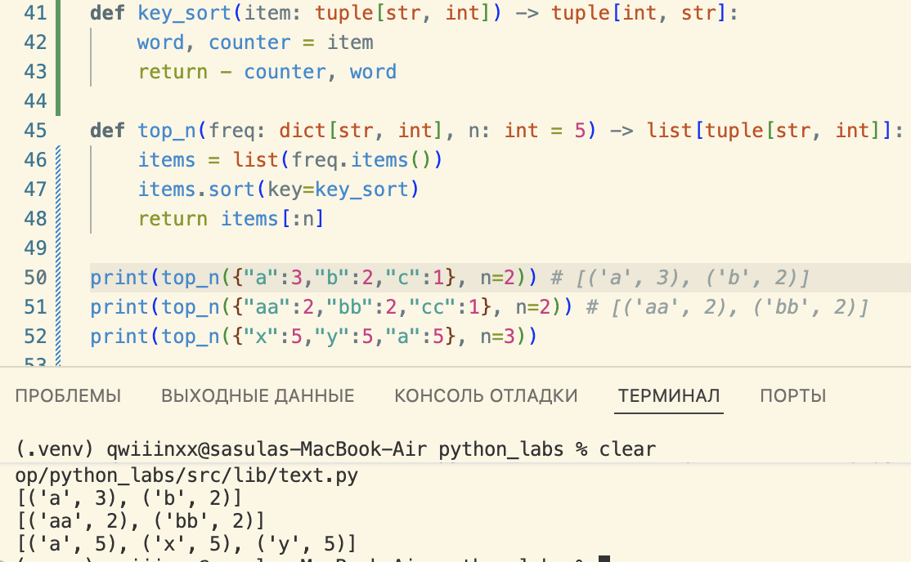
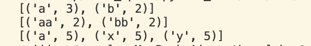
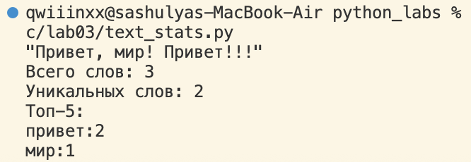

## Задание А
#### функция normalize
```python
def normalize(text: str, *, casefold: bool = True, yo2e: bool = True) -> str:
    s = text.strip()
    if casefold:
        s = s.casefold()
    
    if yo2e:
        s = s.replace('ё', 'е').replace('Ё', 'е')

    s = " ".join(s.split())
    return s

print(normalize("ПрИвЕт\nМИр\t")) # "привет, мир"
print(normalize("ёжик, Ёлка")) # "ежик, елка"
print(normalize("Hello\r\nWorld")) # "hello world"
print(normalize("  двойные   пробелы  ")) # "двойные пробелы"
```


#### функция tokenize
```python
def tokenize(text: str) -> list[str]:
    result = []
    word = ''
    for i, w in enumerate(text):
        if w.isalnum() or w == '_':
            word += w
        elif w == '-' and word and i + 1 < len(text) and text[i+1].isalnum():
            word += w
        else:
            if word:
                result.append(word)
                word = ''
    if word:
        result.append(word)
    return result

print(tokenize("привет мир"))
print(tokenize("hello,world!!!"))
print(tokenize("по-настоящему круто"))
print(tokenize("2025 год"))
print(tokenize("emoji 😀 не слово"))
```

<<<<<<< HEAD
функция count_freq
=======

#### функция count_freq
>>>>>>> c7122c7 (n)
```python
def count_freq(tokens: list[str]) -> dict[str, int]:
    result = {}
    for i in tokens:
        result[i] = result.get(i, 0) + 1
    return result

print(count_freq(["a","b","a","c","b","a"]))
print(count_freq(["bb", "aa", "bb", "aa", "cc"]))
```


#### функция top_n
```python
def top_n(freq: dict[str, int], n: int = 5) -> list[tuple[str, int]]:
    items = list(freq.items())
<<<<<<< HEAD

    # cортировка пузырьком по убыванию частоты,
    # а при равенстве — по алфавиту слова
    for i in range(len(items)):
        for j in range(len(items) - i - 1):
            word1, count1 = items[j]
            word2, count2 = items[j + 1]

            # Сравниваем по частоте
            if count1 < count2:
                items[j], items[j + 1] = items[j + 1], items[j]
            # Если частоты равны — сравниваем по алфавиту
            elif count1 == count2 and word1 > word2:
                items[j], items[j + 1] = items[j + 1], items[j]

=======
    items.sort(key=lambda x: (-x[1], x[0]))  # сначала по частоте, потом по слову
>>>>>>> 03b9ebc (new)
    return items[:n]

print(top_n({"a":3,"b":2,"c":1}, n=2)) # [('a', 3), ('b', 2)]
print(top_n({"aa":2,"bb":2,"cc":1}, n=2)) # [('aa', 2), ('bb', 2)]
print(top_n({"x":5,"y":5,"a":5}, n=3))
```




## Задание В
вводим в терминал строчку из слов и нажимаем control + D
```python
import sys, os # НАЖАТЬ control + D 
sys.path.append(os.path.abspath(os.path.join(os.path.dirname(__file__), "../..")))
from src.lib.text import normalize, tokenize, count_freq, top_n

def main():
    # читаем весь ввод (до EOF)
    text = sys.stdin.read()

    # нормализация
    norm_text = normalize(text)

    # токенизация
    tokens = tokenize(norm_text)

    # частоты
    freq = count_freq(tokens)

    # топ 5
    top = top_n(freq, n=5)

    print(f"Всего слов: {len(tokens)}")
    print(f"Уникальных слов: {len(freq)}")
    print("Топ-5:")
    for word, count in top:
        print(f"{word}:{count}")

if __name__ == "__main__":
    main()
```

