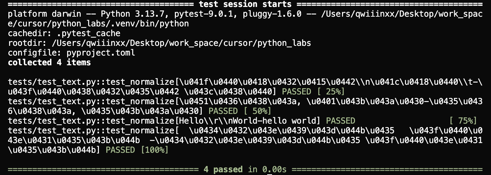
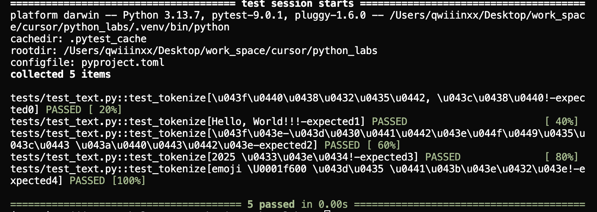
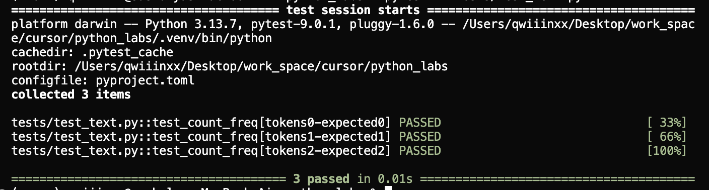
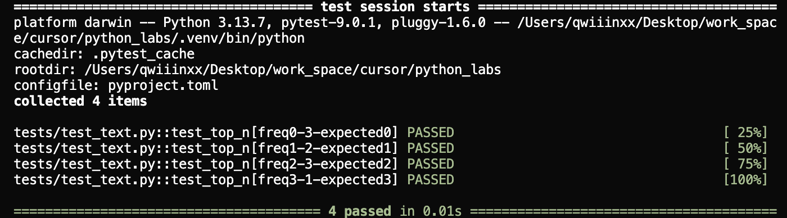
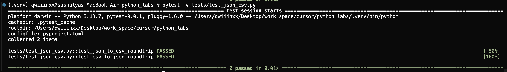

# Лабораторная № 7
## **pytest + black**
#### Устанавливаем ```pip install pytest```
## Задание А
### Запуск через: `pytest -v tests/test_text.py`
```python
from src.lib.text import normalize, tokenize, count_freq, top_n
import pytest

@pytest.mark.parametrize("text, expected", [
        ("ПрИвЕт\\nМИр\\t", "привет мир"),
        ("ёжик, Ёлка", "ежик, елка"),
        ("Hello\\r\\nWorld", "hello world"),
        ("  двойные   пробелы  ", "двойные пробелы"),
    ])  
def test_normalize(text, expected):
    assert normalize(text) == expected


@pytest.mark.parametrize("text, expected", [
    ("привет, мир!", ["привет", "мир"]),
    ("Hello, World!!!", ["Hello", "World"]),
    ("по-настоящему круто", ["по-настоящему", "круто"]),
    ("2025 год!", ["2025", "год"]),
    ("emoji 😀 не слово!", ["emoji", "не", "слово"]),
])
def test_tokenize(text, expected):
    assert tokenize(text) == expected


@pytest.mark.parametrize("tokens, expected", [
    (["c", "b", "a", "c", "b", "a"], {"a":2, "b":2, "c":2}),
    (["bb", "aa", "bb", "aa", "cc"], {"aa":2, "bb":2, "cc":1}),
    (["c","b","c","c","b","a"], {"c":3, "b":2, "a":1}),
])
def test_count_freq(tokens, expected):
    assert count_freq(tokens) == expected


@pytest.mark.parametrize("freq, n,expected", [
    ({"c":2, "b":2, "a":2}, 3, [("a", 2), ("b", 2), ("c", 2)]),
    ({"bb":2, "aa":2, "cc":1}, 2,[("aa", 2), ("bb", 2)]),
    ({"x":5, "y":5, "a":5}, 3, [("a", 5), ("x", 5), ("y", 5)]),
    ({"x":5, "y":5, "a":5}, 1, [("a", 5)]),
])
def test_top_n(freq, n, expected):
    assert top_n(freq, n=n) == expected
```
Pytest:

---

---

---

---

## Задание В
### Запуск через ```pytest -v tests/test_json_csv.py```
## Позитивные сценарии
```python
import pytest
import json
import csv
from pathlib import Path
from src.lab05.json_csv import json_to_csv, csv_to_json


def test_json_to_csv_roundtrip(tmp_path: Path):
    src = tmp_path / "people.json"
    dst = tmp_path / "people.csv"

    data = [
        {"name": "Alice", "age": 22},
        {"name": "Bob", "age": 25},
    ]

    src.write_text(json.dumps(data, ensure_ascii=False, indent=2), encoding="utf-8")

    json_to_csv(str(src), str(dst))

    
    with dst.open(encoding="utf-8") as f:
        rows = list(csv.DictReader(f))

    assert len(rows) == 2
    assert set(rows[0].keys()) == {"name", "age"}
    assert rows[0]["name"] == "Alice"
    assert rows[1]["age"] == "25"


def test_csv_to_json_roundtrip(tmp_path: Path):
    src = tmp_path / "people.csv"
    dst = tmp_path / "people.json"

    data = [
        {"name": "Alice", "age": "22"},
        {"name": "Bob", "age": "25"},
    ]

    
    with src.open("w", encoding="utf-8", newline="") as f:
        writer = csv.DictWriter(f, fieldnames=["name", "age"])
        writer.writeheader()
        writer.writerows(data)

    
    csv_to_json(str(src), str(dst))


    with dst.open(encoding="utf-8") as f:
        rows = json.load(f)

    assert len(rows) == 2
    assert {"name", "age"} <= set(rows[0].keys())
    assert rows == data
```

---
## Негативные сценарии
### Негативные тесты для `csv_to_json`
```python
def test_json_to_csv_file_not_found(tmp_path: Path):
    """Несуществующий JSON файл, должен вызывать FileNotFoundError"""
    non_existent = tmp_path / "nonexistent.json"
    dst = tmp_path / "output.csv"
    
    with pytest.raises(FileNotFoundError, match="файл не найден"):
        json_to_csv(str(non_existent), str(dst))


def test_json_to_csv_wrong_extension(tmp_path: Path):
    """Неправильное расширение файла, должно вызывать ValueError"""
    src = tmp_path / "data.txt"
    dst = tmp_path / "output.csv"
    src.write_text('{"test": "data"}', encoding="utf-8")
    
    with pytest.raises(ValueError, match="ожидается JSON-файл"):
        json_to_csv(str(src), str(dst))


def test_json_to_csv_empty_file(tmp_path: Path):
    """Пустой JSON файл, должен вызывать ValueError"""
    src = tmp_path / "empty.json"
    dst = tmp_path / "output.csv"
    src.write_text("", encoding="utf-8")
    
    with pytest.raises(ValueError, match="ошибка чтения json"):
        json_to_csv(str(src), str(dst))


def test_json_to_csv_invalid_json(tmp_path: Path):
    """Некорректный JSON, должен вызывать ValueError"""
    src = tmp_path / "invalid.json"
    dst = tmp_path / "output.csv"
    src.write_text("{ invalid json }", encoding="utf-8")
    
    with pytest.raises(ValueError, match="ошибка чтения json"):
        json_to_csv(str(src), str(dst))


def test_json_to_csv_empty_list(tmp_path: Path):
    """Пустой список в JSON, должен вызывать ValueError"""
    src = tmp_path / "empty_list.json"
    dst = tmp_path / "output.csv"
    src.write_text("[]", encoding="utf-8")
    
    with pytest.raises(ValueError, match="Пустой JSON"):
        json_to_csv(str(src), str(dst))


def test_json_to_csv_not_list(tmp_path: Path):
    """JSON не является списком, должен вызывать ValueError"""
    src = tmp_path / "not_list.json"
    dst = tmp_path / "output.csv"
    src.write_text('{"key": "value"}', encoding="utf-8")
    
    with pytest.raises(ValueError, match="Пустой JSON или неподдерживаемая структура"):
        json_to_csv(str(src), str(dst))


def test_json_to_csv_not_dicts(tmp_path: Path):
    """Элементы JSON не являются словарями, должны вызывать ValueError"""
    src = tmp_path / "not_dicts.json"
    dst = tmp_path / "output.csv"
    src.write_text('[1, 2, 3]', encoding="utf-8")
    
    with pytest.raises(ValueError, match="Все элементы JSON должны быть словарями"):
        json_to_csv(str(src), str(dst))

```
### Негативные тесты для `csv_to_json`
```python
def test_csv_to_json_file_not_found(tmp_path: Path):
    """Несуществующий CSV файл, должен вызывать FileNotFoundError"""
    non_existent = tmp_path / "nonexistent.csv"
    dst = tmp_path / "output.json"
    
    with pytest.raises(FileNotFoundError, match="Файл не найден"):
        csv_to_json(str(non_existent), str(dst))


def test_csv_to_json_wrong_extension(tmp_path: Path):
    """Неправильное расширение файла, должно вызывать ValueError"""
    src = tmp_path / "data.txt"
    dst = tmp_path / "output.json"
    src.write_text("name,age\nAlice,22", encoding="utf-8")
    
    with pytest.raises(ValueError, match="ожидается CSV-файл"):
        csv_to_json(str(src), str(dst))


def test_csv_to_json_empty_file(tmp_path: Path):
    """Пустой CSV файл, должен вызывать ValueError"""
    src = tmp_path / "empty.csv"
    dst = tmp_path / "output.json"
    src.write_text("", encoding="utf-8")
    
    with pytest.raises(ValueError, match="CSV-файл не содержит заголовка"):
        csv_to_json(str(src), str(dst))


def test_csv_to_json_no_header(tmp_path: Path):
    """CSV только с одной строкой данных (без заголовка), должен вызывать ValueError"""
    src = tmp_path / "no_header.csv"
    dst = tmp_path / "output.json"
    src.write_text("Alice,22", encoding="utf-8")
    
    with pytest.raises(ValueError, match="Пустой CSV-файл"):
        csv_to_json(str(src), str(dst))


def test_csv_to_json_only_header(tmp_path: Path):
    """CSV только с заголовком (без данных), должен вызывать ValueError"""
    src = tmp_path / "only_header.csv"
    dst = tmp_path / "output.json"
    src.write_text("name,age", encoding="utf-8")
    
    with pytest.raises(ValueError, match="Пустой CSV-файл"):
        csv_to_json(str(src), str(dst))
```
