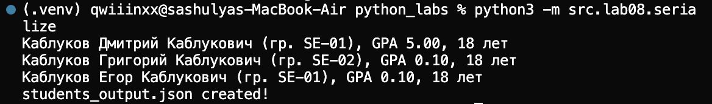
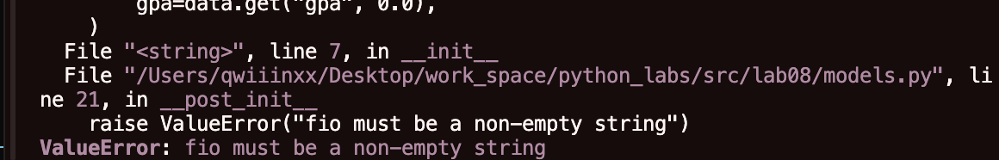
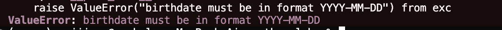

## Лабораторная работа № 8 — ООП: @dataclass Student, методы и сериализация

### Класс `Student` (`models.py`)

```python
from dataclasses import dataclass
from datetime import date, datetime


@dataclass
class Student:
    fio: str          # ФИО студента
    birthdate: str    # дата рождения в формате YYYY-MM-DD
    group: str        # группа, например "SE-01"
    gpa: float        # средний балл 0..5

    def __post_init__(self) -> None:
        # валидация ФИО и группы
        ...

    def age(self) -> int:
        # количество полных лет
        ...

    def to_dict(self) -> dict:
        # словарь для JSON
        ...

    @classmethod
    def from_dict(cls, data: dict) -> "Student":
        # создание из словаря
        ...

    def __str__(self) -> str:
        # человеко‑читаемое представление
        ...
```

**Валидация в `__post_init__`:**

- **формат даты** `YYYY-MM-DD` (`datetime.strptime(self.birthdate, "%Y-%m-%d")`)
- **диапазон среднего балла** `0 ≤ gpa ≤ 5` (при несоответствии выбрасывается `ValueError`)

Метод `age()` использует `date.today()` и дату рождения и возвращает количество **полных лет**.

Методы `to_dict()` / `from_dict()` позволяют преобразовывать объект в словарь и обратно.

Метод `__str__()` возвращает строку вида:

```text
Иванов Иван Иванович (гр. SE-01), GPA 4.25, 20 лет
```
---
### Модуль `serialize.py`

```python
from pathlib import Path
from .models import Student


def students_to_json(students: list[Student], path: str | Path) -> None:
    # сериализация списка студентов в JSON-файл
    ...


def students_from_json(path: str | Path) -> list[Student]:
    # чтение JSON-файла и создание списка Student
    ...

# вызов функций
if __name__ == "__main__":
    
    # читаем студентов из входного файла
    students = students_from_json("data/lab08/students_input.json")
    for student in students:
        print(student)
    # сохраняем студентов в выходной файл
    students_to_json(students, "data/lab08/students_output.json")
    print("students_output.json created!")
```

- **`students_to_json`**: принимает список объектов `Student`, вызывает `to_dict()` и
  сохраняет JSON‑массив в указанный файл.
- **`students_from_json`**: читает JSON‑массив словарей, для каждого словаря вызывает
  `Student.from_dict`, таким образом выполняя и валидацию данных.

---

### Примеры запуска
#### 1. Всё ок
```bash
python3 -m src.lab08.serialize
```


#### 2. Пустое fio


#### 3. Ложный формат даты YYYY.MM.DD
```json
[
  {
    "fio": "Каблуков Дмитрий Каблукович",
    "birthdate": "2007.05.07",
    "group": "SE-01",
    "gpa": 5.0
  }
]
```
