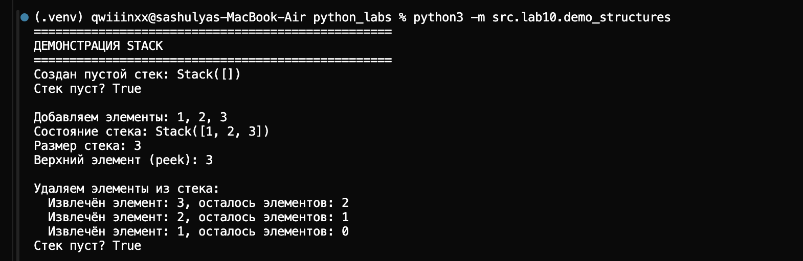
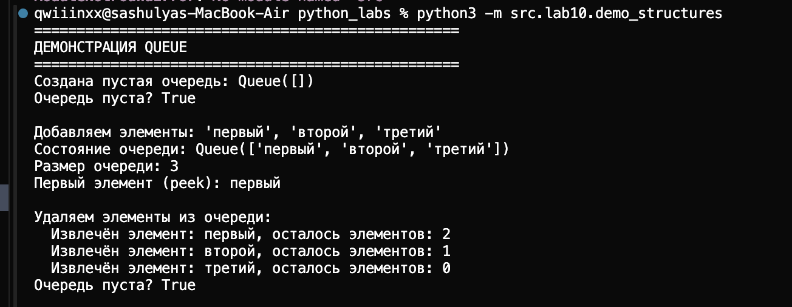
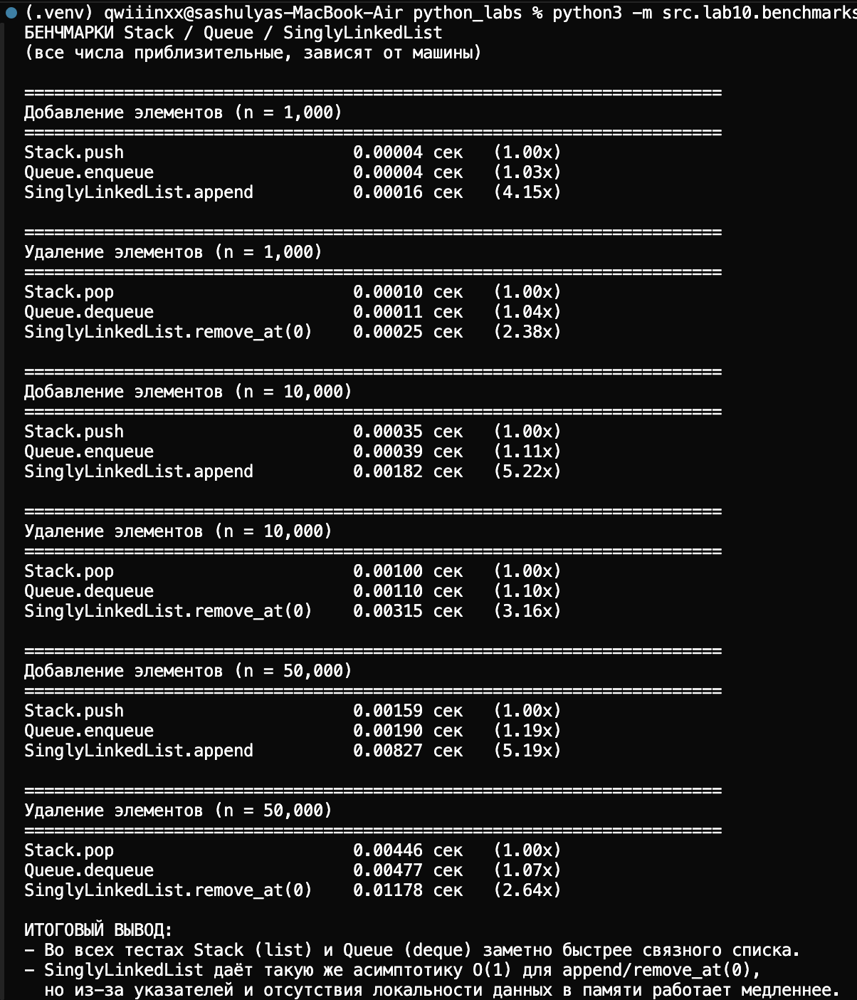

# Лабораторная работа №10

## Структуры данных: Stack, Queue, Linked List и бенчмарки
---
## Краткая теория

### Стек (Stack)

**Определение**: Стек — это структура данных типа LIFO (Last In, First Out — «последним пришёл — первым ушёл»). Элементы добавляются и удаляются только с одного конца, называемого вершиной стека.

**Основные операции**:
- `push()` — добавить элемент на вершину стека. **Сложность: O(1)**
- `pop()` — удалить и вернуть верхний элемент. **Сложность: O(1)**
- `peek()` — посмотреть верхний элемент без удаления. **Сложность: O(1)**
- `is_empty()` — проверить, пуст ли стек. **Сложность: O(1)**

**Применение**: обратная польская нотация, парсинг выражений, отмена операций (undo).
---
### Очередь (Queue)

**Определение**: Очередь — это структура данных типа FIFO (First In, First Out — «первым пришёл — первым ушёл»). Элементы добавляются в конец очереди, а удаляются из начала.

**Основные операции**:
- `enqueue()` — добавить элемент в конец очереди. **Сложность: O(1)**
- `dequeue()` — удалить и вернуть первый элемент. **Сложность: O(1)**
- `peek()` — посмотреть первый элемент без удаления. **Сложность: O(1)**
- `is_empty()` — проверить, пуста ли очередь. **Сложность: O(1)**

**Применение**: планировщики задач, обработка запросов, BFS (поиск в ширину), буферизация данных.

---

### Связный список (Linked List)

**Определение**: Связный список — это структура данных, состоящая из узлов (nodes), где каждый узел содержит данные и ссылку на следующий узел. В односвязном списке (Singly Linked List) каждый узел знает только о следующем узле.

**Основные операции**:
- `append(value)` — добавить элемент в конец списка. **Сложность: O(1)** с tail, O(n) без tail
- `prepend(value)` — добавить элемент в начало списка. **Сложность: O(1)**
- `insert(idx, value)` — вставить элемент по индексу. **Сложность: O(n)**
- `remove_at(idx)` — удалить элемент по индексу. **Сложность: O(n)**
- `remove(value)` — удалить первое вхождение значения. **Сложность: O(n)**
- `__iter__()` — итерация по элементам. **Сложность: O(n)**

**Преимущества перед массивами**:
- Динамическое изменение размера
- Вставка/удаление в начало за O(1)
- Не требует непрерывной памяти

**Недостатки**:
- Нет случайного доступа по индексу за O(1)
- Дополнительная память на хранение указателей
- Больше накладных расходов при итерации

---

## Описание реализованных классов

### Stack `structures.py`

Класс `Stack` реализован на базе `list`. Вершина стека — последний элемент списка (`self._data[-1]`).

**Пример использования**:
```python
from src.lab10.structures import Stack

stack = Stack()

# Добавление элементов
stack.push(1)
stack.push(2)
stack.push(3)

print(stack.peek())  # 3
print(len(stack))    # 3

# Удаление элементов
print(stack.pop())   # 3
print(stack.pop())   # 2
print(stack.is_empty())  # False
print(stack.pop())   # 1
print(stack.is_empty())  # True
```

**Демонстрация**:


---

### Queue `structures.py`

Класс `Queue` реализован на базе `collections.deque` для эффективных операций добавления и удаления с обоих концов.

**Пример использования**:
```python
from src.lab10.structures import Queue

queue = Queue()

# Добавление элементов
queue.enqueue("первый")
queue.enqueue("второй")
queue.enqueue("третий")

print(queue.peek())      # "первый"
print(len(queue))        # 3

# Удаление элементов
print(queue.dequeue())   # "первый"
print(queue.dequeue())   # "второй"
print(queue.is_empty())  # False
print(queue.dequeue())   # "третий"
print(queue.is_empty())  # True
```

**Демонстрация**:



---

### SinglyLinkedList `linked_list.py`

Класс `SinglyLinkedList` реализует односвязный список с поддержкой `tail` для оптимизации операций добавления в конец.

**Пример использования**:
```python
from src.lab10.linked_list import SinglyLinkedList

lst = SinglyLinkedList()

# Добавление элементов
lst.append(1)
lst.append(2)
lst.prepend(0)

print(list(lst))         # [0, 1, 2]
print(len(lst))          # 3
print(str(lst))          # [0] -> [1] -> [2] -> None

# Вставка по индексу
lst.insert(2, 1.5)
print(list(lst))         # [0, 1, 1.5, 2]

# Удаление по индексу
lst.remove_at(1)
print(list(lst))         # [0, 1.5, 2]

# Удаление по значению
lst.remove(1.5)
print(list(lst))         # [0, 2]

# Итерация
for value in lst:
    print(value)         # 0, затем 2
```
```bash
==================================================
ДЕМОНСТРАЦИЯ SINGLY LINKED LIST
==================================================
Создан пустой список: SinglyLinkedList([])
Размер списка: 0
Красивое представление: None

Добавляем элементы в конец: 1, 2, 3
Список: [1] -> [2] -> [3] -> None
Красивое представление: [1] -> [2] -> [3] -> None
Размер: 3

Добавляем элемент в начало: 0
Список: [0] -> [1] -> [2] -> [3] -> None
Красивое представление: [0] -> [1] -> [2] -> [3] -> None
Размер: 4

Вставляем элемент по индексу 2: 1.5
Список: [0] -> [1] -> [1.5] -> [2] -> [3] -> None
Красивое представление: [0] -> [1] -> [1.5] -> [2] -> [3] -> None


==================================================
УДАЛЕНИЕ ЭЛЕМЕНТОВ
==================================================
Исходный список: [1] -> [2] -> [3] -> [4] -> [5] -> None
Красивое представление: [1] -> [2] -> [3] -> [4] -> [5] -> None

Удаляем элемент по индексу 2 (значение 3):
Список: [1] -> [2] -> [4] -> [5] -> None
Красивое представление: [1] -> [2] -> [4] -> [5] -> None

Удаляем первое вхождение значения 4:
Список: [1] -> [2] -> [5] -> None
Красивое представление: [1] -> [2] -> [5] -> None


==================================================
ИТЕРАЦИЯ ПО СПИСКУ
==================================================
Список: [A] -> [B] -> [C] -> None
Красивое представление: [A] -> [B] -> [C] -> None

Итерация через for loop:
  Индекс 0: A
  Индекс 1: B
  Индекс 2: C

Преобразование в list:
  ['A', 'B', 'C']


==================================================
ОБРАБОТКА ОШИБОК
==================================================
Попытка insert(10, 99) в список размера 2:
  Поймано исключение: Index 10 is out of range. List size is 2.

Попытка remove_at(10) в список размера 2:
  Поймано исключение: Index 10 is out of range. List size is 2.

Попытка remove(99) (значение отсутствует):
  Поймано исключение: Value 99 not found in list

Попытка remove_at(0) из пустого списка:
  Поймано исключение: Cannot remove from empty list

==================================================
ГРАНИЧНЫЕ СЛУЧАИ
==================================================
Вставка в пустой список:
  insert(0, 'начало'): [начало] -> None
  insert(1, 'конец'): [начало] -> [конец] -> None

Удаление единственного элемента:
  До удаления: [один] -> None
  После remove_at(0): None
  Размер: 0
```

---

## Бенчмарки и сравнение производительности

Для сравнения производительности были проведены бенчмарки различных операций на разных структурах данных.

### Методика бенчмарков

Бенчмарки запускаются через `python3 -m src.lab10.benchmarks` и измеряют время выполнения операций на структурах данных разных размеров.

### Результаты и выводы


---

### Итоговый вывод по бенчмаркам

- **Stack** и **Queue** во всех тестах работают быстрее, чем `SinglyLinkedList`, при одинаковой асимптотике \(O(1)\) для основных операций.
- **SinglyLinkedList** выгоден только там, где критична вставка/удаление в начало за \(O(1)\) и не нужен быстрый доступ по индексу.
- На практике в Python в большинстве задач достаточно и выгоднее использовать встроенные структуры (`list`, `deque`), а связный список полезен в первую очередь как учебный пример реализации структур данных.

---